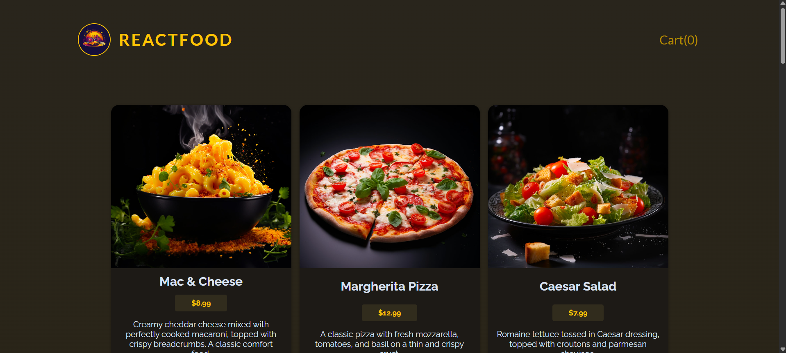
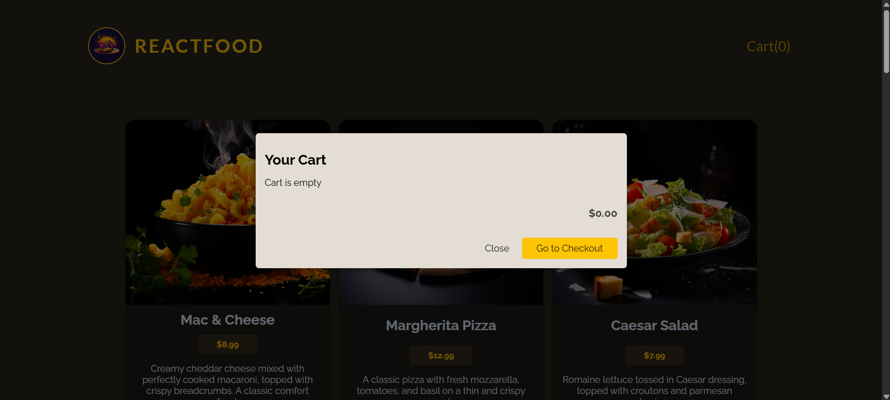
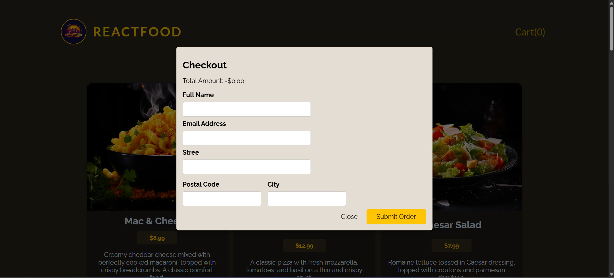
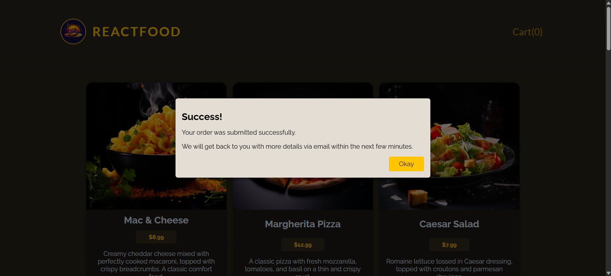

# 🍔 Food Order App

A full-stack food ordering application built with React.js and Express.js, featuring a modern UI with Redux state management, real-time cart updates, and a complete checkout flow. This project demonstrates essential e-commerce functionalities with a restaurant food ordering system.

## 📸 Project Showcase

| Home Page | Cart Page | Checkout Page | Dashboard |
|-----------|------------|-------------------|-----------|
|  |  |  |  |

---

## ✨ Features

- **🍕 Browse Menu**: Display of 20 delicious food items with images, descriptions, and prices
- **🛒 Shopping Cart**: Add items to cart with real-time quantity updates
- **➕➖ Cart Management**: Increase/decrease quantities or remove items from cart
- **💰 Live Price Calculation**: Dynamic total price updates using USD currency formatting
- **📝 Checkout Process**: Multi-step modal flow (Cart → Checkout → Success)
- **✅ Form Validation**: Complete customer information collection with validation
- **🎉 Toast Notifications**: User feedback for cart actions and order confirmation
- **🔄 State Management**: Redux Toolkit for predictable state updates
- **🌐 REST API**: Express backend with CORS-enabled endpoints
- **📦 Order Persistence**: JSON-based storage for orders

## 🛠️ Technologies Used

### Frontend
- **React.js** (v18.2.0) - UI library
- **Redux Toolkit** (v2.2.7) - State management
- **React Redux** (v9.1.2) - React bindings for Redux
- **Vite** (v4.4.5) - Build tool and dev server
- **React Hot Toast** (v2.4.1) - Notification system
- **CSS Modules** - Component-scoped styling

### Backend
- **Node.js** - JavaScript runtime
- **Express.js** (v4.18.2) - Web framework
- **Body Parser** (v1.20.2) - Request parsing middleware
- **ES Modules** - Modern JavaScript module system
- **CORS** - Cross-origin resource sharing

## 📁 Project Structure

```
Food-Order-App/
├── backend/
│   ├── app.js                    # Express server with API routes
│   ├── package.json              # Backend dependencies
│   ├── data/
│   │   ├── available-meals.json  # Menu items database
│   │   └── orders.json           # Orders storage
│   └── public/
│       └── images/               # 20 food item images
│
├── frontend/
│   ├── src/
│   │   ├── App.jsx               # Root component
│   │   ├── main.jsx              # Application entry point
│   │   ├── index.css             # Global styles
│   │   ├── components/
│   │   │   ├── Header.jsx        # App header with cart button
│   │   │   ├── Meals.jsx         # Menu items display
│   │   │   ├── YourCart.jsx      # Modal container component
│   │   │   ├── CartInfoModal.jsx # Cart view modal
│   │   │   ├── CheckOutModal.jsx # Checkout form modal
│   │   │   └── SuccessModal.jsx  # Order confirmation modal
│   │   ├── store/
│   │   │   ├── index.js          # Redux store configuration
│   │   │   ├── foodSlice.js      # Cart & meals state slice
│   │   │   ├── uiSlice.js        # UI state (modal views)
│   │   │   └── foodItemActions.js# Async API actions
│   │   └── utils/
│   │       └── Formatter.js      # USD currency formatter
│   ├── package.json              # Frontend dependencies
│   └── vite.config.js            # Vite configuration
│
└── readme.md                     # Project documentation
```

## 🚀 Getting Started

### Prerequisites
- Node.js (v14 or higher)
- npm or yarn

### Installation

1. **Clone the Repository**:
   ```bash
   git clone https://github.com/umardraz2004/Food-Order-App.git
   cd Food-Order-App
   ```

2. **Install Backend Dependencies**:
   ```bash
   cd backend
   npm install
   ```

3. **Install Frontend Dependencies**:
   ```bash
   cd ../frontend
   npm install
   ```

### Running the Application

1. **Start the Backend Server** (Terminal 1):
   ```bash
   cd backend
   npm start
   ```
   Server runs on `http://localhost:3000`

2. **Start the Frontend Development Server** (Terminal 2):
   ```bash
   cd frontend
   npm run dev
   ```
   Frontend runs on `http://localhost:5173`

3. **Open your browser** and navigate to `http://localhost:5173`

## 🔌 API Endpoints

### GET `/meals`
- Fetches all available menu items
- Returns: Array of meal objects with id, name, price, description, image

### POST `/orders`
- Creates a new order
- Request body:
  ```json
  {
    "order": {
      "items": [...],
      "customer": {
        "name": "string",
        "email": "string",
        "street": "string",
        "postal-code": "string",
        "city": "string"
      }
    }
  }
  ```
- Returns: `{ "message": "Order created!" }`

## 📸 Available Food Items (Images)

The app features 20 high-quality food items with images:

| Category | Items |
|----------|-------|
| **Comfort Food** | Mac & Cheese, Pancake Stack |
| **Pizza & Pasta** | Margherita Pizza, Spaghetti Carbonara, Eggplant Parmesan |
| **Burgers & Sandwiches** | Veggie Burger, Grilled Chicken Sandwich |
| **International** | Chicken Curry, Miso Ramen, Seafood Paella, Sushi Roll Platter |
| **Salads & Bowls** | Caesar Salad, Vegan Buddha Bowl, Falafel Wrap |
| **Premium** | Steak Frites, Lobster Bisque |
| **Vegetarian** | Mushroom Risotto |
| **Desserts** | Chocolate Brownie, Lemon Cheesecake |
| **Tacos** | Beef Tacos |

All images are stored in `/backend/public/images/` and served statically.

## 🎯 Key Features Explained

### State Management
- **foodSlice.js**: Manages meals, cart items, quantities, prices, and loading states
- **uiSlice.js**: Controls modal view switching (cart → checkout → success)
- **Redux Thunks**: Async API calls for fetching meals and submitting orders

### Modal Flow
1. **Cart Info Modal**: Display cart items, manage quantities, show total
2. **Checkout Modal**: Collect customer details with form validation
3. **Success Modal**: Order confirmation with cart reset

### Cart Functionality
- Add items with duplicate prevention
- Increase/decrease quantities with real-time price updates
- Remove items when quantity reaches zero
- Automatic cart empty state detection

## 🎨 Styling

- Custom CSS with CSS Modules for component-scoped styles
- Responsive design for various screen sizes
- Modal dialogs with backdrop blur
- Button hover effects and transitions
- Loading spinner animation

## 🔧 Configuration

### CORS Setup
Backend allows all origins with:
- Methods: GET, POST
- Headers: Content-Type

### Vite Configuration
- React plugin enabled
- Fast HMR (Hot Module Replacement)
- Optimized production builds
---